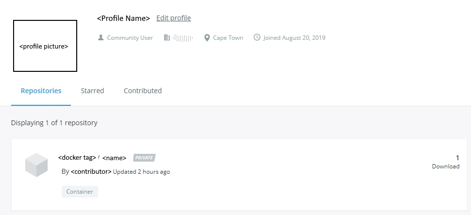

# Add Contrainer to Docker Hub

### Introduction

A docker image exists, created in Visual Studio Code, that is ready to be pushed into [Docker Hub](https://cloud.docker.com).  Visual Studio Code must be logged into Docker Hub, i.e. you need an account.

### Log Into Docker Hub

Use a Visual Studio Code Terminal to log into Docker Hub.  **Note**: add bin\ and obj\ to the [_Dockerignore_ file](https://codefresh.io/docker-tutorial/not-ignore-dockerignore/) in the project to avoid loading unnecessary code.

```text
PS <docker image path> docker login docker.io
Login with your Docker ID to push and pull images from Docker Hub. If you don't have a Docker ID, head over to https://hub.docker.com to create one.
Username: <Docker Hub User Name>
Password: <**********>
Login Succeeded
```

The connection between Visual Studio Code and Docker Hub is established.  A "push" of the docker file is possible.

### Push Docker File to Docker Hub

Use a Visual Studio Code Terminal to log into Docker Hub.

```text
PS <code path> docker push <docker tag>/<container name>:<version>
The push refers to repository [docker.io/<user>/<container name>]
f66c29beddb1: Pushed
8a81d99df707: Pushed
349c7f00d08e: Pushed
370f72f4d447: Pushed
8dc6654a61c6: Pushed
8fa655db5360: Pushed
1.0.0: digest: sha256:da9c1373eec821828bc4af69d0b5287926f7647bb1bb113ad154323e3fabd713 size: 1579
```

### Docker File Name

A docker file name standard exist by which to name image.  It must conform to the [Regular Expression](https://regex101.com/) below.

```text
[\w][\w.-]{0,127}
```

Building an image \(command below\) illustrated the tag or name of the package in relation to the regular expression match pattern.

```text
docker build -t username/image_name:tag_name .
```

### Docker Hub Container Entry

Once the "push" succeeds, the Docker container is registered in Docker Hub.



