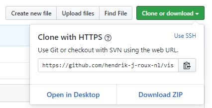
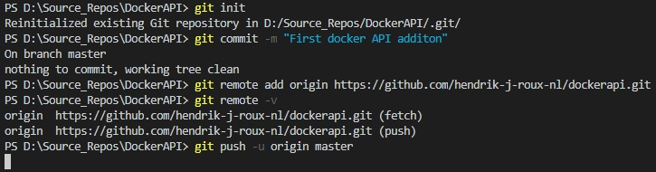
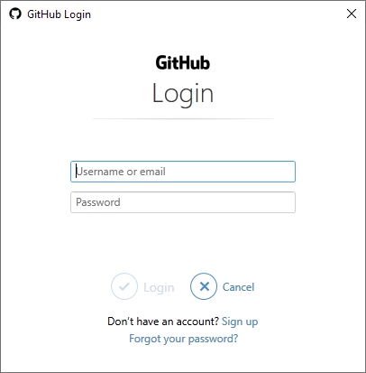

# Add VSC Project to GitHub

### Introduction

Working in Visual Studio Code, a project is created and ready to go into a source control repository.  For this example we're using [GitHub](https://github.com).  Use the Commands below to add a project to an existing GitHub repository.  

### Commands

Create a local Git repository, commit, and then push to the cloud GitHub repository.

```text
# Open a new Terminal in Visual Studio Code
# Navigate the the project folder
git init

# Commit the local code to the local Git repo
git commit -m "Your comment"

# Create a new repo in GitHub (https://github.com)
# Copy the GitHub repository Url and head back to the Visual Studio Code UI
# Map the remote repo to the local Git repo
git remote add origin <Link to GitHub Repo>

# Verify the link on the remote repository
git remote -v

# Push the committed changes to remote GitHub repository
git push -u origin master
```

### Push Particulars

```text
git push -u origin master
```

In response to the "push" to the remote repository the GitHub Login Dialog makes the link.  Alternatively, keep a lookout for  Username and Password prompts in the Visual Studio Code Terminal.

```text
Username for 'https://github.com': hendrik-j-roux-nl
Password for 'https://hendrik-j-roux-nl@github.com': 
Counting objects: 38, done.
Delta compression using up to 4 threads.
Compressing objects: 100% (28/28), done.
Writing objects: 100% (38/38), 127.33 KiB | 2.71 MiB/s, done.
Total 38 (delta 2), reused 0 (delta 0)
remote: Resolving deltas: 100% (2/2), done.
To https://github.com/hendrik-j-roux-nl/dockerapi.git
 * [new branch]      master -> master
Branch 'master' set up to track remote branch 'master' from 'origin'.
```








