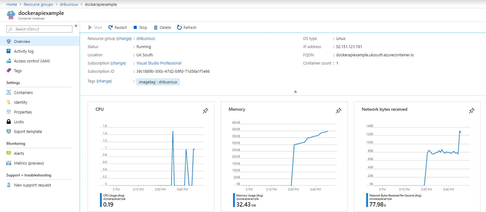

# Deploy Docker Image to Azure

### Introduction

Microsoft Azure is a cloud computing platform and services.  One of these provide a container instance resource within which to run a Docker image.  For [MSDN account holders](https://blogs.msdn.microsoft.com/msgulfcommunity/2014/09/15/how-to-activate-azure-benefit-for-msdn-subscribers/#targetText=Did%20you%20know%20that%20all,MSDN%20software%20in%20the%20cloud.), Azure is accessible on a quota basis.  This benefit can be activated to unlock the monthly credits.  Log into your Azure account to create a Container Instance resource.

**Reference**: Les Jackson is a very nice presenter and you can see his tutorial [Deploy a .NET API with Docker \(step-by-step\)](https://www.youtube.com/watch?v=f0lMGPB10bM&t=1473s) for a contiguous delivery.

### Container Instance

Docker containers are run in Azure by an [Azure Container Instance](https://docs.microsoft.com/en-us/azure/container-instances/container-instances-quickstart-portal), i.e. without the provision of virtual machines.

#### Project Details

Microsoft wants to know how this is paid for.  In this example, an MSDN license is used, i.e. Visual Studio Professional.

* **Subscription** - Visual Studio Professional/ Pay-as-you-go
* **Resource group** - collection sharing same life-cycle, permissions, and policies
  * **Create new** - simply supply a name: &lt;nameofreourcegroup&gt;

#### Container Details

Pertains to the container, where to deploy \(Azure data centre location\) and from what source to retrieve the image, viz. Public or Private with what image name.

* **Container name** - supply a name as identifier in Azure and can be different to container name
* **Region** - pick a location for a Azure data centre in which to deploy this
* **Image type** - Public \(no credentials\) or Private \(with credentials\)

#### Private Image

A [Private image](https://apidocs.joyent.com/docker/features/repos) \(from [Docker Hub](https://cloud.docker.com)\) requires access credentials.

* **Image registry login server**: index.docker.io
* **Image registry user name**: the &lt;user name&gt; of the account that has access to Docker Hub
* **Image registry password**: the &lt;password&gt; with which access to Docker Hub is achieved
* **OS Type** - Linux/ Windows

**Networking**

Configure ports, protocols, DNS.  Without a public IP address the container is still accessible via the command line.

* **Include public address** - Yes
* **Ports** - 80 \(to suffice the example container's .Net Core API application\)
* **DNS name label** - public IP label tacked onto the data centre reference, e.g. .uksouth.azurecontainer.io

#### Advanced

Restart, variables, and command overrides.

* **Restart policy** - when to do so, options in drop-down reflect.
* \*\*\*\*[**Environmental variables**](https://docs.microsoft.com/en-us/azure/container-instances/container-instances-environment-variables) - dynamic configuration for application of script\(s\) run by container.  This is similar to the --env command-line argument to docker run.
* \*\*\*\*[**Command override**](https://docs.microsoft.com/bs-latn-ba/azure/container-instances/container-instances-start-command) - override the baked in command line instructions of the Docker image. This behaviour is similar to the --entrypoint command-line argument to docker run.
* Tags - name-value pairs to group billing and categorise resources

### Container Instance Overview

After a successful deployment, using the \[Go to resource\] button, the Container instance overview is visible.

The application is called on: [http://dockerapiexample.uksouth.azurecontainer.io/api/values](http://dockerapiexample.uksouth.azurecontainer.io/api/values)

