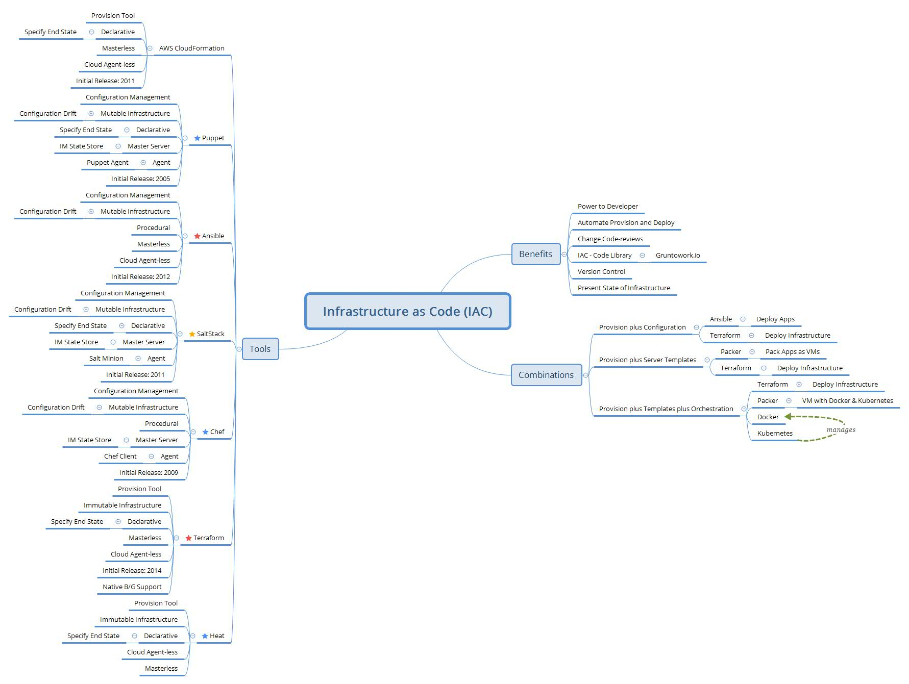

# Infrastructure as Code \(IAC\)

## Introduction

Infrastructure as Code \(IAC\) deploys servers, networks, and configuration as code that can be stored in a code repository and deployed to a cloud data centre via a tool like Terraform. Infrastructure as Code tools are listed below in a comparative analysis for context of where Terraform contextually finds itself.

Terraform deploys immutable infrastructure \(new instances every time\) in a declarative manner, i.e. considers the end-state of the script with the potential delta present to only deploy the difference.  Its master and agent are part of the cloud platform service and is therefore master and agent-less.  it supports Blue-Green deployments by default and is a relatively new release circa 2014.  Together with Ansible it is one of the top most used and contributed tools in the market.

IAC provides control to developers who can define and manage infrastructure.  Automated provision and deployment via the continuous pipeline supports the Agile continuum of continual release.  the present state of infrastructure can be managed dynamically with tools like Kubernetes to not only keep enough services running but also the wider infrastructure up to date and audit-able.  IAC libraries provide template code \(Terraform configuration\) that can be downloaded and used by any organisation, e.g. [Gruntworks Code Library](https://www.gruntwork.io/infrastructure-as-code-library/).

Visual Studio Code has a [Terraform extension by Mikael Olenfalk](https://marketplace.visualstudio.com/items?itemName=mauve.terraform) by which to create infrastructure scripts to deploy via Terraform in AWS.

